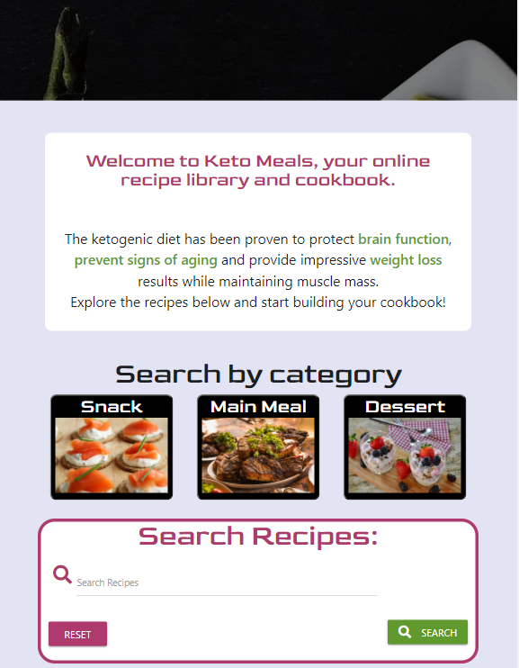
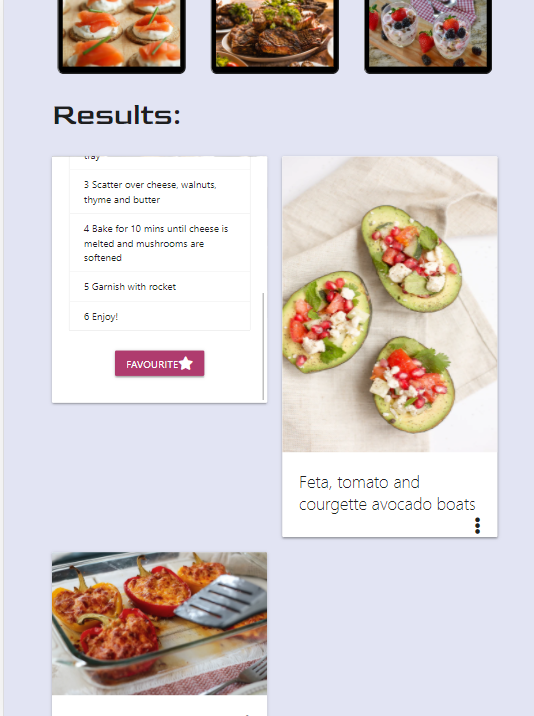
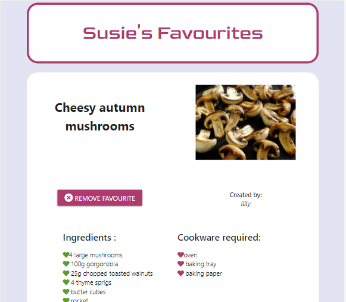
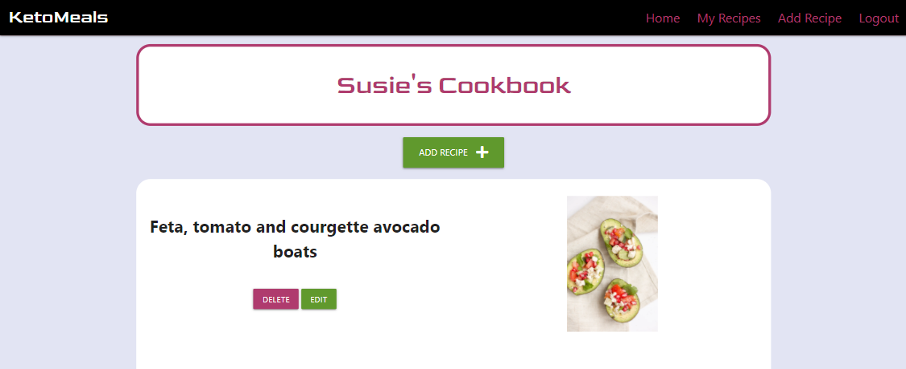
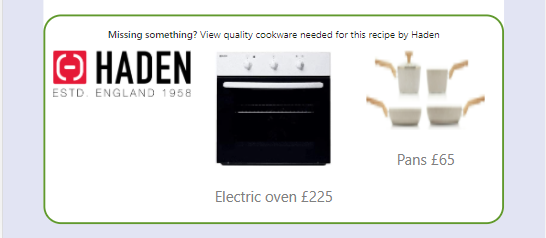
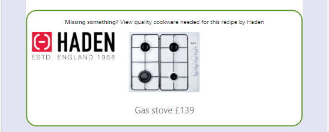

# **KetoMeals**

Keto meals is a site for a cookbook database which allows users to find recipes they can use when following a ketogenic diet. The website informs visitors of the benefits of this type of diet as well as allowing them to build their own personalised cookbook to make their lifestyle change easier. The website also allows users to view cookware products they may need from a promoted brand.

The project consists of 5 pages. When a user first visits the site, the pages available to them will be the homepage and register/login page. On registering/logging in they will gain access to the my recipes, add recipe and logout button.
 The homepage gives the user the chance to understand the types of recipes available and the aim of the ketogenic diet. The search capabilities are flexible allowing users to search either by meal type or by recipe or ingredient name. 
 The register page allows users to create an account for the site. After registering the user is directed to their profile page (my recipes), here they are invited to add a recipe, which will become available for all users to view. 
 Only the user is able to edit or delete the recipe. When browsing recipes, users can decide to add their favourites to their personal page for easy viewing. 

## **User Stories & UX**

### **Overall design**
1. Viewing several popular recipe sites gave me an idea of the styling conventions for online cookbooks.
 It is clear users only want to see an image of the recipe and name while searching. When a recipe is selected ingredients and steps are presented simply, making the recipe easy to follow. 
 Colours are minimal with most focus on the recipe images.
 Websites used for inspiration:
[BBC good food](https://www.bbcgoodfood.com/recipes), [Delicious magazine](https://www.deliciousmagazine.co.uk/recipes/), [All recipes](http://allrecipes.co.uk/recipes/)

2. The color palette was created with [coolors](https://coolors.co/), I chose this palette as the lighter colours will ensure focus remains on the images. The brighter colours draw attention to important parts of the page for easy navigation and give the page more vibrancy.
[Palette Used](https://coolors.co/274c77-af3b6e-d8ddef-60992d-ffffff)

### **User Stories**
1. I am new to keto lifestyle and want to know why I should follow this and what would be available to me.
2. I am following a keto diet and need ideas on what to cook which I can access quickly and easily
3. I am following a keto diet and want to see if the site has recipes for a specific ingredient I want to use
4. I am a follower of the keto diet and want to share my recipes and update them if I’ve found a better way to make them
5. I am the site owner and would like to promote Haden cookware

### **Wireframes**

Wireframes created for this project:
* [Homepage](static/images/wireframes/home.png)
* [Add Recipe and Edit Recipe pages](static/images/wireframes/add_edit.png)
* [Register and Login pages](static/images/wireframes/register_login.png)
* [My recipes page](static/images/wireframes/user_recipes.png)

### **Database Schema**

### __Users__

| Field names    | Datatype     |
| :------------- | :----------: | 
| _id            | ObjectId     |
|  username      | string       | 
| password       | string       |
| favourites     | array        |

### __Types__
| Field names    | Datatype     |
| :------------- | :----------: | 
|  _id           | ObjectId     | 
|  meal_type     | string       |

### __Recipes__
| Field names    | Datatype     |
| :------------- | :----------: | 
|  _id           | ObjectId     | 
|  meal_type     | string       |
| recipe_name    | string       |
|  ingredients   | string       | 
|  instructions  | string       |
| cookware       | string       |
| image_url      |   string     |
| created_by     |    string    |

## **Features**

### **Sitewide Features**

* __Navigation bar__ is dark to compliment both the lighter site colour theme and image backgrounds.
Bar is collapsible and appears as a bar icon on smaller screen sizes. Navigation shows the "Register", "Login" 
and homepage links to user's who aren't logged in. For registered users, the links are "My recipes", "Add recipe",
"Home" and "Logout".
* __Cookware promotion__ appears below most recipes. A selection of cookware from the brand Haden is 
displayed based on the cookware required for the recipe. The cookware is displayed through an image link,
name of product and price. When selected, the user is directed to the amazon purchase page for the product.
Where the recipe contains none of the promoted products, the users will still see the Haden logo and link to
visit the store. The promotion style is simple and subtle, a white background with a bright green border is 
used to make it stand out and seperate it from the recipe.

### **Homepage**

* __Header image__ is a simple colourful image of keto food. The image is overlayed with a black translucent cover featuring the brand name appearing in a large white font. 
The header introduces the site and gives the user an idea of what to expect.
* __Introduction text__ welcomes the user to start creating their cookbook. The benefits of the keto way of eating is described briefly and users are invited to view the recipes.
The text is intended to inform users who are not familiar with the keto diet and entice them to explore further.
* __Meal Type selector buttons__ are the first method of exploring the recipes. Buttons for each meal type allow the user to select the meal type they want to explore
and view relevant recipes. The buttons are made up of a large image, showing an example of the meal type and a heading. Background color is dark to draw attention against the lighter
colour scheme and keep the main focus on the images.
* __Meal Type results__ are displayed below the buttons, in the form of cards. Cards show the recipe image and title only until selected,
once clicked on, an overlay containing the recipe and ingredients appears. This allows users to view more than one recipe at a time.
* __Search bar__ allows users to search for recipes by ingredient or recipe name. 
* __Search results__ are displayed as a list of collapsibles with the recipe name and image appearing side by side. Once 
recipe is selected, the drop down reveals the recipe and relevant cookware promotion. This section also contains different buttons 
depending on the identity of the user. If the user is the recipe owner, they have the option of "Edit" or "Delete"; while other users
will see a "favourite" button, used to add the recipe to their personal page.

### **Register/Login Pages**
* __Image background__ is of a wooden table with a knife and fork and a form centered in the middle. The image motivates
the user to sign up and start cooking. 
* __Form__ uses a translucent black background to fit with the image but remain readable. The register form allows the 
user to choose an alphanumeric username and password. When the form is submitted, the user's username, hashed password and 
an empty favourites array are added to the database. If the form is incorrectly filled the input fields will be highlighted
in red to alert the user. The login form allows the user to sign in to their account, if the users input doesn't match with
a user in the database they will be shown a message telling them the username or password is invalid.

### **My Recipes** 
* __User Header__ is styled with site theme colours.
* __Own Recipes__ show the recipes the user has generated with the option of updating or deleting them. The recipe is styled
simply so it's easy to follow. The recipe image and name are shown on top, then ingredients and cookware are displayed through
bullet points lists in site theme colors. Ingredients appear as a collection in seperate boxes, again for ease of reading. Lastly 
the cookware promotion is seen.
* __Favourite Recipes__ are displayed with the same layout for consistency but contain a button to remove the recipe 
from the user's favourites.

### **Add Recipe**
* __Image Background__ is a bright image of a selection of food, making the page vibrant will envoke a positive response from the user and motivate them to complete the form.
* __Form__ is used to add a recipe to the database and is styled using site theme colours. Form contains a field for each recipe requirement in the database. For longer input, such as in ingredients or instructions, expected input 
is explained through helper text below the input field. All fields must be filled out for the recipe to be submitted and incorrectly filled fields will be highlighted in red so the user understands what needs correcting. Helper text
is also provided below input fields to ensure user understands the format.

### **Edit Recipe**
* __Image Background__ is the same image as the add recipe page so form is easily recognised by the user.
* __Form__ is used to update a recipe in the database and is styled using site theme colours. The form's input fields are prefilled with the current recipe data, allowing the user
to easily make adjustments to the recipe. 

### __Defensive Programming features__
* __Forms__ cannot be submitted unless all fields are correctly filled in 
* __Login form__ mistakes are not accredited to "Incorrect password" or "Incorrect username" specifically to ensure people don't use this to hack into others accounts.
* __Registered Users__ don't have access to edit and delete buttons of recipes so they don't alter other users data.
* __Unregistered Users__ do not have access to Add Recipe button to prevent database being flooded with data from non-users.

### Features left to implement

## Technologies used
* __HTML__ was used to build all templates.
* __CSS__ was used to style the HTML.
* [__Balsamic__](https://balsamiq.cloud/#) was used to create the wireframes for the project.
* __Javascript__ was used to add responsive features.
* [__Materialize__](https://materializecss.com/) grid was used for page structure. Components were also used to display data.
* __Jquery__ was used to make materialise components functional and simplify javascript.
* __Python__ was used to write the logic for the app.
* __Mongodb__ was used to hold the database for the project.
* __Flask and pymongo__ was used to create the app and connect to the database.
* __Jinja__ templates were used to create and structure page content.
* __Werkzeug__ was used to encrypt and check password inputs.
* [__Fontawesome__](https://fontawesome.com/) was used to add icons throughout the site.
* [__Googlefonts__](https://fonts.google.com/) was used for the main font throughout the site.
* [__W3C Validator__](https://validator.w3.org/) was used to check HTML for errors.
* [__Jigsaw__](https://jigsaw.w3.org/css-validator/) was used to check CSS for errors
* [PEP8](http://pep8online.com/) was used to check python code for errors.

## __Testing__

All code was put through validators (listed above) and passed with no errors.
Except for and error on the edit and add page which is outlined in the bugs section below.

### __Testing is user stories needs are met__

1. I am new to keto lifestyle and want to know why I should follow this and what would be available to me.
    * Homepage has a brief explanation about the benefits of following a ketogenic diet. Directly below are the meal type 
    selector buttons where a user can see what their meals might look like, they can also use the search bar to see if the 
    database contains their favourite foods.
    

2. I am following a keto diet and need ideas on what to cook which I can access quickly and easily
    * Users are able to view recipes on the homepage by the meal type they want to make right now or by searching the ingredient they want to use
    * While browsing, they also have the option of saving the recipes they like to their favourites, which appear on their personal 
    page. This allows users to create their own personalised cookbook full of their favorite recipes, for immediate access when logging in. 

    

    * Users are also able to remove any recipe from their favourite.
    

3. I am following a keto diet and want to see if the site has recipes for a specific ingredient I want to use
    * The search bar is located on the home page, users have the option to search for recipes by ingredient or by name of the recipe.

4. I am a follower of the keto diet and want to share my recipes and update them if I’ve found a better way to make them
    
    * On logging in to the site the user is able to share their recipes, either through the “add recipe” button on the navigation or on their personal page.
    * On the users personal recipe page, alongside every recipe is an edit or delete button, if a user decides they want to update or remove a recipe all together.
5. I am the site owner and would like to promote Haden cookware
    
    
    * On every recipe, based on the cookware specified, adverts will appear at the end showing the relevant Haden cookware. Adverts contain the Haden logo, 
    an image, name of the product and lead to the purchase page of the product on Amazon when pressed.
    * Seeing as the adverts appear on every recipe both registered and guest users will be able to see them.

### __Testing Functionality and Responsive design__

#### __Site Wide Features__
* __Navigation bar__
    * To test navigation bar is functional, I clicked on all navigation links which all led to the named page. The toggle button displayed on smaller screen widths
    and led to the correct pages.
* __Cookware promotion__ 
    I pressed each of the advert links on all the recipes in the "My recipes" and "Home" pages. Each opened the relevant products amazon purchase page in 
    a new tab as expected. Images resized on smaller device screen width to maintain advert appearance.

#### __Homepage__
* __Meal Type selector buttons__ I tested each of these buttons by pressing them and checking results which appeared were for the correct meal type.
* __Meal Type results__ are displayed through cards with an expandable section for the recipe. As cards were created through a template I clicked on 
the toggle for one recipe of each type to ensure the correct data was displaying.
* __Search bar__ was tested by searching for the words "stevia" and "tomato" as they appear in several recipes. All recipes containing 
the words were displayed. One featured the word exclusively in the recipe name and the others were ingredients.
* __Search results__ collapsible list results all open when clicked on to display the correct recipe and cookware promotions. Using google developer tools,
I checked whether images and text resized to fit well in smaller screen widths.

### **Register Page**
* __Form__ 
    * I filled in the form using a username which is already in the database, the page reloaded with an alert at the top saying
    "Username taken!". I checked the database on mongodb to ensure nothing had been added.
    * I filled in the form with a username not on the database containing a non alphanumeric character, the username input turned red and displayed
    some red helper text saying password can't contain special characters or be less than 5 characters.I tried to submit with the error but a pop up
    alert appeared at the text input,to remind me the format is incorrect.
    * I filled in the form with a username under 5 letters, the username input field border turned red and helper text appeared again, pop up alert appeared 
    as before when I tried to submit the form.
    * I filled in the form with a username containing 5 alphanumeric characters and a password and submitted the form. I checked the database to ensure data
    had been added and password encrypted.

### **Login Page**
* __Form__ 
    * I filled in the form using a username which is not in the database, the page reloaded with an alert at the top saying
    "Invalid username/password".
    * I filled in the form with a username on the database but using an incorrect password, again the page reloaded with an
    alert above the form saying "Invalid username/password".
    * I filled in the form with a username and password of a registered user, I was directed to the user's 
    my recipe page containing all their recipes. An alert appeared above Welcoming the user.

### **My Recipes** 
* __Add Recipe button__ I clicked the add recipe button on the my recipes page for a user and was directed to the "Add a recipe" page.
* __Own Recipes__ user recipes are being displayed, with relevant cookware promotions. Each contains an edit and delete button.
    * I pressed the edit button and was directed to the edit page for the specific recipe with the input fields prefilled. 
    * I pressed the delete button on a test recipe I added and checked it had been removed from the database.
* __Favourite Recipes__ users favourited recipes are displayed with relevant cookware promotions. Each contains a "remove favourite"
button. I pressed the button which directed me back to the homepage with an alert saying "Favourite saved". I checked the database 
to ensure the user's favourites no longer contained the specific recipe id.

### **Add Recipe**
* __Form__ 
    * I filled out the form completely and was redirected to the homepage,
    an alert also appeared saying "Recipe added!". I checked the database to 
    ensure the recipe had been added.
    * I filled out the form leaving some fields blank and tried to submit the form. A pop up alert 
    appeared at the missed out field asking me to fill it in.

### **Edit Recipe**
* __Form__ 
    * I opened a recipe with an incorrect meal type. I chose the correct one from the dropdown and 
    submitted the form. A message appeared above the form when the page reloaded saying "Recipe Updated!".
    * I checked the recipe had updated on the database.

## __Bugs__

### __Fixed__
1. A white bar was appearing at the bottom of the login/register pages image background on large screen sizes. I 
changed the body element minimum height to 100vh, which made the picture take up the whole screen. 

### __Not yet fixed__
 1. When running the edit and add recipe pages through the html validator, I got an error with a materialize
 component. The dropdown selector menu for the field "meal type" is causing the error: "Bad value true for attribute 
 readonly on element input". The readonly attribute is added automatically to the component.
 2. When a user has added a recipe as a favourite, if the recipe is deleted by the owner or admin, it still displays 
 the favourite box for the recipe but without the relevant details. When the user tries to remove the empty favourited 
 recipe, the site throws an error as it cannot extract the ObjectId it needs to remove from favourites.

 ## __Deployment__
The project was created on Gitpod and pushed to Github after each major change. The master branch was used as a source for deployment on Heroku. The development version is the same as the deployed version.

### __Steps taken to deploy__ 
1. In the workspace for the project, I ran the following command to add a requirements file to the file system.
Heroku uses this file in order to understand dependancies used for the project.
    `pip3 freeze--local > requirements.txt`
2. Next I ran the command below in order to create the Procfile needed for Heroku deployment.
    `echo web: python app.py > Procfile`
3. Push files to Github.
3. Next I opened Heroku website, logged in and navigated to my dashboard.
4. I created a new project using the "Create a New App" button on the Heroku dashboard. The app was named "ketomeals-project".
5. I was then directed to the app dashboard. Under the "Deployment Method" section I chose Github.
6. I found my github repository using the search bar. The repo appeared below and I clicked "Connect".
7. Next, from the project dashboard on Heroku, I selected "Settings" tab on the navigation below the project title.
8. In Setting, I found the "Config Vars" section and clicked "Reveal Config Vars"
9. Here I inputted details contained in the env.py file in the github workspace, so they could be securely accessed to run the 
    app on Heroku. Once this section was complete I clicked "Add".
    Details required were:
    * IP 
    * PORT
    * SECRET_KEY
    * MONGO_URI
    * MONGO_DBNAME
10. Next, from the project dashboard, I selected the "Deploy" tab from the navigation below the project title and scrolled 
down to the "Automatic deploys" section.
11. I pressed the Enable Automatic deploys and chose the master branch to build the app.

The deployed site is avaliable at [Keto Meals](https://ketomeals-project.herokuapp.com/)

 ## __Credits__

### __Media__
* Photos used for this site were taken from [pixabay](https://pixabay.com/) and [unsplash](https://unsplash.com/).

### __Acknowledgements__
* I recieved inspiration for this project from [BBC good food](https://www.bbcgoodfood.com/recipes), [Delicious magazine](https://www.deliciousmagazine.co.uk/recipes/), [All recipes](http://allrecipes.co.uk/recipes/).
* I recieved guidance and assistance from the CodeInstitute support team.